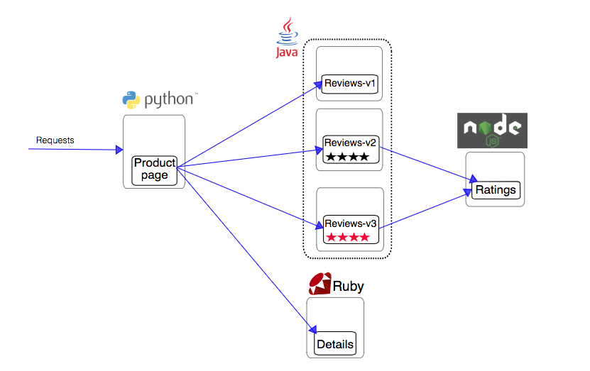
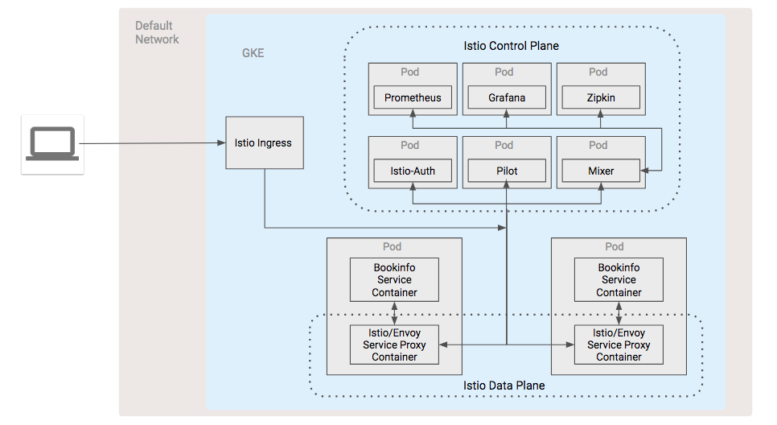

# Istio in a Kubernetes Engine Cluster

* [Istio Service Mesh expansion to GCE](#istio-service-mesh-expansion-to-gce)
  * [Introduction](#introduction)
  * [Architecture](#architecture)
        * [Istio Overview](#istio-overview)
            * [Istio Control Plane](#istio-control-plane)
            * [Istio Data Plane](#istio-data-plane)
        * [BookInfo Sample Application](#bookinfo-sample-application)
        * [Architecture](#architecture-1)
  * [Prerequisites](#prerequisites)
        * [Tools](#tools)
  * [Deployment](#deployment)
        * [Validation](#validation)
        * [Tear Down](#tear-down)
  * [Troubleshooting](#troubleshooting)
  * [Relevant Material](#relevant-material)

## Introduction

Istio is part of a new category of products known as "service mesh" software
designed to manage the complexity of service resilience in a microservice
infrastructure; it defines itself as a service management framework built to
keep business logic separate from the logic to keep your services up and
running. In other words, it provides a layer on top of the network that will
automatically route traffic to the appropriate services, handle [circuit
breaker](https://en.wikipedia.org/wiki/Circuit_breaker_design_pattern) logic,
enforce access and load balancing policies, and generate telemetry data to
gain insight into the network and allow for quick diagnosis of issues.

For more information on Istio, please refer to the [Istio
documentation](https://istio.io/docs/). Some familiarity with Istio is assumed.

This repository contains demonstration code to create an Istio service mesh in
a single GKE cluster and use [Prometheus](https://prometheus.io/),
[Jaeger](https://www.jaegertracing.io/), and [Grafana](https://grafana.com/) to
collect metrics and tracing data and then visualize that data.

## Architecture

#### Istio Overview

Istio has two main pieces that create the service mesh: the control plane and
the data plane.

##### Istio Control Plane

The control plane is made up of the following set of components that act
together to serve as the hub for the infrastructure's service management.

- **Mixer**: a platform-independent component responsible for enforcing access
  control and usage policies across the service mesh and collecting telemetry
  data from the Envoy proxy and other services

- **Pilot**: provides service discovery for the Envoy sidecars, traffic
  management capabilities for intelligent routing, (A/B tests, canary
  deployments, etc.), and resiliency (timeouts, retries, circuit breakers,
  etc.)

- **Citadel**: provides strong service-to-service and end-user authentication
  using mutual TLS, with built-in identity and credential management.

##### Istio Data Plane

The data plane is comprised of all the individual service proxies that are
distributed throughout the infrastructure. Istio uses
[Envoy](https://www.envoyproxy.io/) with some Istio-specific extensions as its
service proxy. It mediates all inbound and outbound traffic for all services in
the service mesh. Istio leverages Envoy’s many built-in features such as
dynamic service discovery, load balancing, TLS termination, HTTP/2 & gRPC
proxying, circuit breakers, health checks, staged roll-outs with
percentage-based traffic splits, fault injection, and rich metrics.

#### BookInfo Sample Application

The sample [BookInfo](https://istio.io/docs/guides/bookinfo.html)
application displays information about a book, similar to a single catalog entry
of an online book store. Displayed on the page is a description of the book,
book details (ISBN, number of pages, and so on), and a few book reviews.

The BookInfo application is broken into four separate microservices and calls on
various language environments for its implementation:

- **productpage**. The productpage microservice calls the details and reviews
  microservices to populate the page.
- **details**. The details microservice contains book information.
- **reviews**. The reviews microservice contains book reviews. It also calls the
  ratings microservice.
- **ratings**. The ratings microservice contains book ranking information that
  accompanies a book review.

There are 3 versions of the reviews microservice:

- **Version v1** doesn’t call the ratings service.
- **Version v2** calls the ratings service, and displays each rating as 1 to 5
  black stars.
- **Version v3** calls the ratings service, and displays each rating as 1 to 5
  red stars.



To learn more about Istio, please refer to the
[project's documentation](https://istio.io/docs/).

#### Architecture

The pods and services that make up the Istio control plane is the first part of
the architecture that gets installed into Kubernetes Engine, at the time we install the
BookInfo application we simultaneously install an istio service proxy alongside
each micro service in the application. Our telemetry add-ons are then added to
the Control Plane. At this point we have our two tiers that make up the Istio
architecture, our Control Plane and our Data Plane, and we have microservices to
manage.

In the diagram, note
- all input and output from any BookInfo microservice goes through the service
  proxy
- each service proxy communicates with each other and the Control plane to
  implement the features of the service mesh, circuit breaking, discovery, etc.
- the Mixer component of the Control Plane is the conduit for the telemetry
  add-ons to get metrics from the service mesh
- the Istio ingress component to provide external access to the mesh
- the environment is setup in the Kubernetes Engine default network




## Prerequisites

#### Tools

In order to use the code in this demo you will need to have have access to a
bash shell with the following tools installed:

* Two [GCP projects](https://cloud.google.com/) with billing enabled
* [Google Cloud SDK (v204.0.0 or later)](https://cloud.google.com/sdk/downloads)\
* [kubectl (v1.10.0 or later)](https://kubernetes.io/docs/tasks/tools/install-kubectl/)
* git

## Deployment

To deploy this demo, clone the repository and change directory to the
`gke-istio-demo` directory. Note that this directory is considered the working
directory and all of the following commands should be run in it.

1. Copy the `properties` file to `properties.env` and set the following
   variables in the `properties.env` file:
       * PROJECT - the name of the project you want to use
       * REGION - the region in which to locate for all the infrastructure
       * ZONE - the zone in which to locate all the infrastructure
1. Run the following command

```console
./execute.sh
```

The script should deploy all of the necessary infrastructure and install Istio.

## Validation

1. On the command line, run the following command:
```console
echo "http://$(kubectl get -n istio-system service istio-ingressgateway -o jsonpath='{.status.loadBalancer.ingress[0].ip}'):$(kubectl get -n istio-system service istio-ingressgateway -o jsonpath='{.spec.ports[?(@.name=="http")].port}')/productpage"
```
2. Visit the generated URL in your browser to see the BookInfo application.

##### View Prometheus UI

1. Run the following command on the command line
```console
kubectl -n istio-system port-forward $(kubectl -n istio-system get pod -l app=prometheus -o jsonpath='{.items[0].metadata.name}') 9090:9090 &
```
2. Visit the following URL in your web browser: http://localhost:9090/graph

For more information on how to use Prometheus with Istio, please refer to the
[Istio documentation](https://istio.io/docs/tasks/telemetry/querying-metrics/)

##### View Grafana UI

1. Run the following command:
```console
kubectl -n istio-system port-forward $(kubectl -n istio-system get pod -l app=grafana -o jsonpath='{.items[0].metadata.name}') 3000:3000 &
```
2.  Visit the following url in your web browser:
http://localhost:3000/dashboard/db/istio-dashboard

For more information on how to use Grafana with Istio, please refer to the
[Istio documentation](https://istio.io/docs/tasks/telemetry/using-istio-dashboard/)

##### View Jaeger UI

1. Run the following command:

```console
kubectl port-forward -n istio-system $(kubectl get pod -n istio-system -l app=jaeger -o jsonpath='{.items[0].metadata.name}') 16686:16686 &
```

2. Visit the following url in your web browser: http://localhost:16686

For more information on how to generate sample traces, please refer to the [Istio
documentation](https://istio.io/docs/tasks/telemetry/distributed-tracing/).

## Tear Down

To tear down the resources created by this demonstration, run

```console
./remove.sh
```

## Troubleshooting

## Relevant Material

This demo was created with help from the following links:

* https://cloud.google.com/kubernetes-engine/docs/tutorials/istio-on-gke
* https://cloud.google.com/compute/docs/tutorials/istio-on-compute-engine
* https://istio.io/docs/guides/bookinfo.html
* https://istio.io/docs/tasks/telemetry/querying-metrics/
* https://istio.io/docs/tasks/telemetry/using-istio-dashboard/
* https://istio.io/docs/tasks/telemetry/distributed-tracing/
